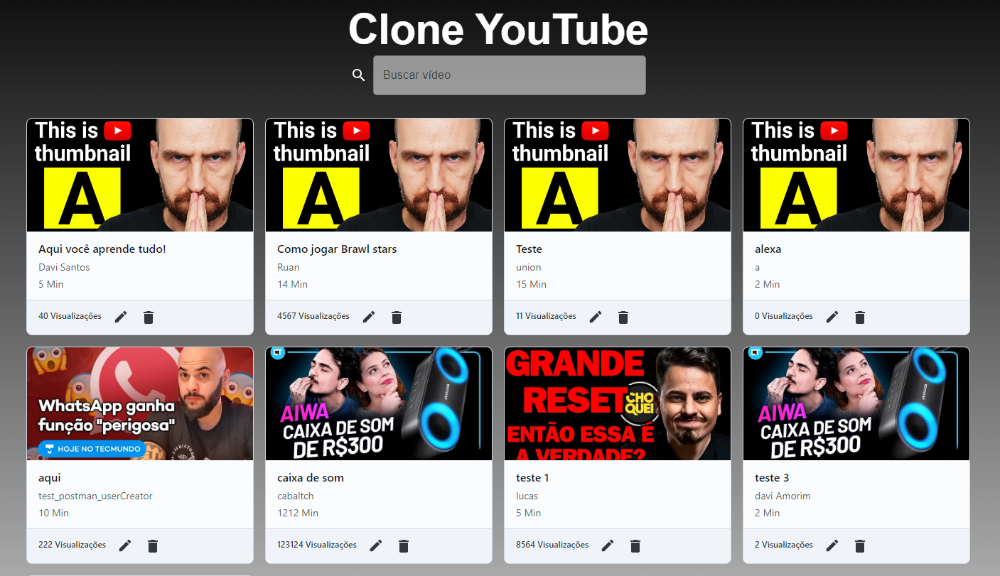
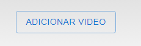
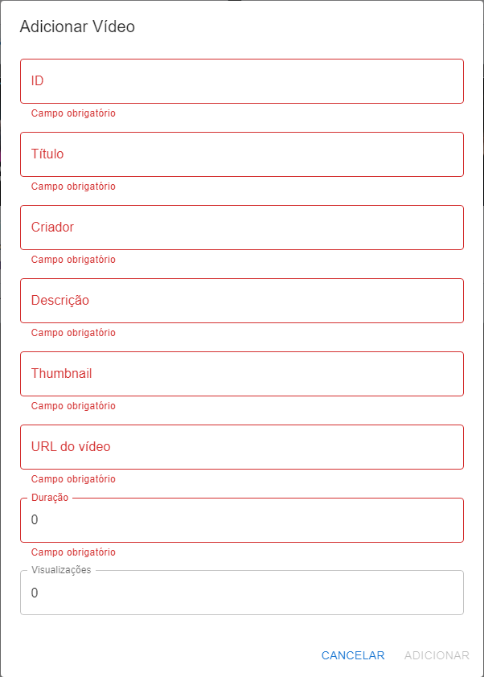
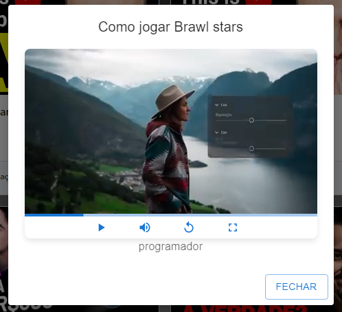

# 🚀 Projeto NestJs de um Grid de Vídeos

## Sobre o Projeto

Este projeto é uma aplicação Next.js que exibe um grid de vídeos com funcionalidades completas de CRUD, permitindo aos usuários adicionar, visualizar, editar e excluir vídeos. No back-end, uma API em Python hospedada na AWS Lambda gerencia a persistência dos dados no DynamoDB, garantindo a integridade e segurança dos dados através de validações rigorosas. O projeto utiliza a API e Router Handler do Next.js para uma integração eficiente front-end/back-end, enquanto o TailwindCSS e o Material-UI são empregados para uma estilização avançada e responsiva, complementados por ícones Material e requisições HTTP eficientes com Axios.

## 💻 Tecnologias Utilizadas

### 🌐 Front-end

- **ReactJS**: Uma biblioteca JavaScript para construir interfaces de usuário
- **TypeScript**: Um superset de JavaScript que adiciona tipagem estática
- **TailwindCSS**: Um framework de CSS para estilização rápida e responsiva
- **Material UI**: Uma biblioteca de componentes React para um design mais rápido e acessível
- **Material Icons**: Biblioteca de ícones para enriquecer a interface do usuário
- **Axios**: Cliente HTTP baseado em promessas para fazer requisições
- **Next.js**: Framework React para produção que torna a construção de interfaces de usuário escaláveis e eficientes

### 🔧 Back-end

- **Python**: Linguagem de programação de alto nível, utilizada para desenvolver a API
- **AWS Lambda**: Serviço de computação serverless que executa o código em resposta a eventos
- **AWS DynamoDB**: Banco de dados NoSQL oferecendo desempenho em escala
- **AWS API Gateway**: Serviço totalmente gerenciado que facilita aos desenvolvedores a publicação, manutenção, monitoramento e proteção de APIs em qualquer escala

## ⚡ Início Rápido

### 📋 Pré-requisitos

- Node.js
- NPM/Yarn

### ⚙️ Configuração do Projeto

1. **Criar o projeto React com Next.js**

    ```bash
    npx create-next-app grid_videos --typescript
    ```

2. **Instalar o TailwindCSS e suas dependências**

    ```bash
    npm install -D tailwindcss@npm:@tailwindcss/postcss7-compat postcss@^7 autoprefixer@^9
    ```

3. **Gerar o arquivo de configuração do TailwindCSS**

    ```bash
    npx tailwindcss init -p
    ```

    > Nota: Como o projeto foi iniciado com Next.js, algumas configurações padrão, incluindo o arquivo de configuração do TailwindCSS, já estão incluídas.

4. **Instalar todas as dependências do projeto**

    ```bash
    npm install
    ```

## 💾 Back-end

### ☁️ AWS

- A documentação detalhada do back-end pode ser encontrada [aqui](./backend/README.md). Lá, você encontrará instruções sobre como configurar e implantar a API Python na AWS Lambda, além de informações sobre a integração com o DynamoDB e o AWS API Gateway.

## 🖥️ Telas da Aplicação

### 📺 Tela Inicial

- Grid de vídeos com funcionalidades completas de CRUD, permitindo aos usuários adicionar, visualizar, editar e excluir vídeos.

    

### 📝 Tela do formulário de adição e edição dos dados do video

- Botão de adição de um novo video

    

- Formulário de adição e edição dos dados do video o botão é dinâmico ser for adição o botão é adicionar se for edição o botão é salvar.

    

### ▶️ Tela de visualização do video

- Tela de repdoção do video onde é possível visualizar o video e os dados do video. os botoes de manipulação do video foram feitos usando o Material UI.

    
